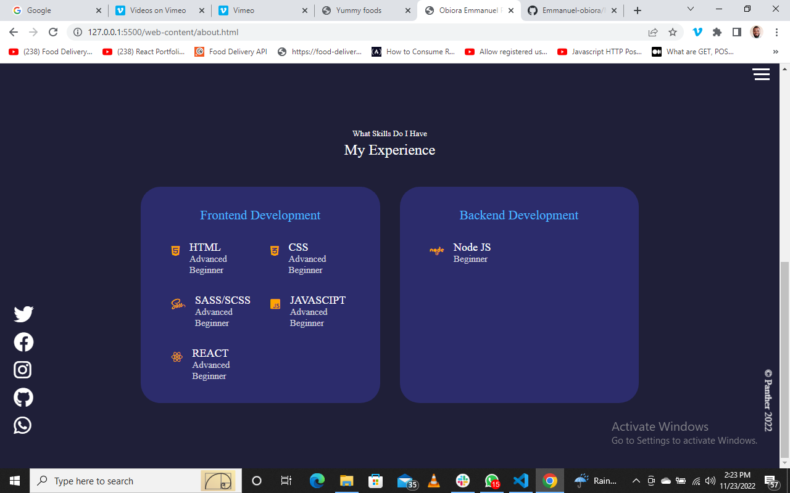
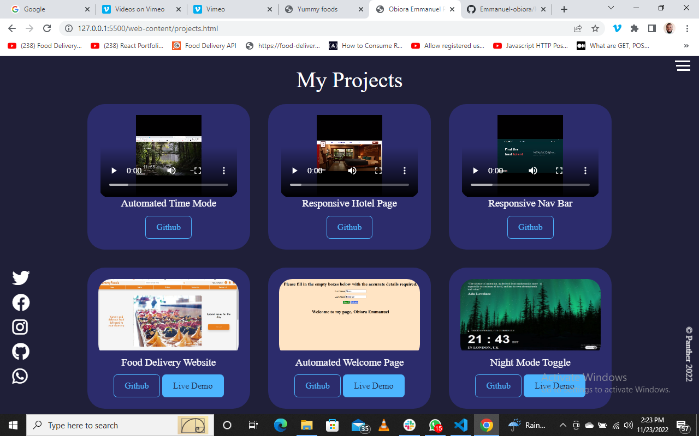

# My Portfolio

## GENERAL INFORMATION

This website is a representation of Obiora Emmanuel covering his growth in tech in terms of real life problem solving.

## Table of Content

* [General info](#general-information)
* [Table of Content](#table-of-content)
* [Introduction](#introduction)
* [Technologies](#technologies)
* [Illustration](#illustrations)
* [Scope of Functionalities](#scope-of-functionalities)
* [Project Status](#project-status)
* [Sources](#sources)
* [Launch](#launch)
* [Other Information](#other-information)

## Introduction

Obiora is a graduate of Computer Engineering from Enugu State University of SCience and Technology, Enugu state, Nigeria. The web pages contains details of few works done from simple algorithm to complex UI design with an enabled means of communication through JavaScript and other improved technologies in relation to JavaScript. Furthermore, details about Obiora can be perused in the about section, then projects accomplished are documented at the projects section while contact details are on the contact page. Finally this portfolio website is developed with the users in minds, hence all iteractiveness required are put in place.  

## Technologies

This project was completed through the use of the following technologies.

1. VScode v1.70.1
2. JavaScript
3. Live Sass Compiler v5.5.1
4. HTML5
5. Font Awesome Icons v4.7.0 and v6.1.1

## Illustrations

Image showing the home page of Yummyfoods.

Image showing the menu list and also steps involve to complete an order.

Image showing one menu list page with eight different items on the menu.

Preview of the login and sign-up modal box.

Image showing a customer default profile page.

## Scope of Functionalities

### Features

* Uniques mix of colors to maintain a welcoming and calm web-page
* The use of known technology uniquely.
* Automated dispatch of email in the conatct page.
* Well organize project portfolio with easy access to important files in relation to a project.

## Project Status

The project is complete. However, it will be updated as new projects are completed.

## Sources

This project was inspired by the will to learn more, and place myself better in the tech space.

* [Coding Artist](https://stackoverflow.com)

## Launch

To run this project on your local machine, simply follow the steps below.

* Install [Vscode](https://code.visualstudio.com/)
* Go to [GitHub](https://github.com/Emmanuel-obiora/Yummy-foods)
* Click on CODE and copy the HTTPS link to clone the project.
* From your VScode terminal clone the project
* Finally click GO Live to view on browser if live server is installed.
* Else right click on the index file and click on open with (any browser installed on your pc would show here)

Or you can view the published work by clicking this link [Yummyfoods](https://emmanuel-obiora.github.io/Yummy-foods/web-content/index.html)

## Other Information

### Author

👤 **Obiora Emmanuel**

* GitHub: [Emmanuel-obiora](https://github.com/Emmanuel-obiora)
* Twitter: [Miroclesdgenius](https://twitter.com/Miroclesdgenius)
* LinkedIn: [obiora-emmanuel](https://www.linkedin.com/in/obiora-emmanuel-b4935616a/)

### Show your support

Give a ⭐️ if you like this project!

### 📝 License

This project is [MIT](https://docs.github.com/en/github/creating-cloning-and-archiving-repositories/licensing-a-repository) licensed.
